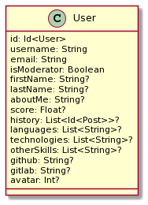
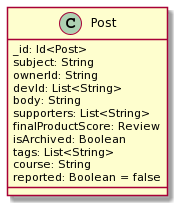
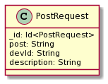

# Universidade Estadual de Campinas

# Instituto da Computação

## Disciplina: MC855-2s2021

#### Professor e Assistente

| Nome                     | Email                   |
| ------------------------ | ----------------------- |
| Professora Juliana Borin | jufborin@unicamp.br     |
| Assistente Paulo Kussler | paulo.kussler@gmail.com |

#### Equipe

| Nome                         | RA     | Email                  | ID Git         |
| ---------------------------- | ------ | ---------------------- | -------------- |
| Frederico Meletti Rappa      | 216047 | f216047@dac.unicamp.br | frerappa       |
| João Alberto Moreira Seródio | 218548 | j218548@dac.unicamp.br | SerodioJ       |
| Roberta Rozendo Veronez      | 186671 | r186671@dac.unicamp.br | robertaveronez |
| Willian Takayuki Ozako       | 207267 | w207267@dac.unicamp.br | oozaku         |

### Descrição do projeto:

O ProjConnect é uma plataforma que permite que pessoas dentro da comunidade da UNICAMP consigam compartilhar ideias de projetos em computação
e que as conecte com pessoas que tenham conhecimento de como desenvolvê-los, criando demanda também para as matérias de projetos.

<!-- #### Prints das telas com descrição das funcionalidades.  -->
<!-- Não faz parte do backend  -->

#### Tecnologias, ferramentas, dependências, versões. etc.

Aqui, no repositório do back end da plataforma de match de projetos, estamos utilizando a framework
[Ktor](https://ktor.io/docs/welcome.html) com a linguagem Kotlin para criar os endpoints consumidos
pelo front. Outro aspecto importante é que implementamos a plataforma com a versão 16 do Java.

Ainda sobre o back end, estamos utilizando a API da Google para conseguir a autenticação dos usuários
para conseguirem entrar na plataforma.

O banco de dados utilizado é o MongoDB Atlas, que é o MongoDB dentro da nuvem e para que o back end
consiga realizar as requisições com o banco de dados, utilizamos [Kmongo](https://litote.org/kmongo/).

#### Estado Atual e Implementações

#### Esquemas Utilizados no Banco de dados

A nossa plataforma implementou três principais entidades que são _User_, _Post_ e _PostRequest_. A relação
é de que cada projeto dentro da plataforma se manifesta em formato de _Post_, _Users_ têm _Posts_ ou podem
participar de um através de um pedido de entrada, _PostRequest_, que será autorizada ou não pelo dono do
_Post_.

##### _User_

Cada usuário tem os seguintes atributos demonstrados na figura abaixo.



Um _User_ tem um _\_id_, que é a chave usada e criada somente dentro do banco de dados, dentro da nossa
plataforma utiliza o e-mail acadêmico para conseguir linkar os dados do login com os dados dentro do
banco de dados, então esse atributo deve ser protegido de quaisquer alterações. Outra chave primária é
o username, que também não deve ser alterada, e é usada no restante das funcionalidades, como linkar
_User_ e _Post_.

Além disso e de outras informações pessoais como o link para o Github e Gitlab, existe uma flag para
indicar se uma pessoa é moderadora e campos para adicionar descrição pessoal e lista de competências
e habilidades como linguagens de programação, tecnologicas (como frameworks) e outras skills.

##### _Post_

Os atributos de um projeto, _Post_, estão listados na figura abaixo



A chave primária do _Post_ é o _\_id_, que é criado automaticamente na criação do _Post_ dentro do banco
de dados e servirá para a identificação de um projeto em toda a plataforma.

Além das informações como título, descrição, usernames do dono e dos desenvolvedores, outros atributos
importantes são: flag para indicar se o projeto ainda está ativo; tags para facilitar a busca de projetos
para por exemplo linguagens e tecnologias envolvidas no projeto; string para apontar a disciplina que está
vinculada; flag se o _Post_ foi denunciado.

##### _PostRequest_

Uma _PostRequest_ é um pedido de um usuário interessado em participar de um projeto e contém os seguintes
atributos listados na imagem abaixo:



Ele contém um _\_id_ usado para alcançar essa request e ela é sempre tem a relação de um _User_ para um
_Post_ e essas entidades são apontadas através do username e do valor do id respectivamente. Além disso,
ele contém uma mensagem do usuário que quer entrar no projeto.

##### Autenticação via API da Google

A nossa plataforma já tem a autenticação funcionando.

O usuário realiza o login com o e-mail da Unicamp e com a API obtemos o e-mail utilizado para o login e:
se o usuário já tiver conta dentro da plataforma, redirecionamos para a página de lista de projetos do front;
caso contrário, redirecionamos o usuário para a página de cadastro também dentro do front end.

#### Endpoints Implementados

| Entidade       | Tipo | Endpoint                           | Função                                                                                                                    |
| -------------- | ---- | ---------------------------------- | ------------------------------------------------------------------------------------------------------------------------- |
| User           | get  | `/search/user/id/{id}`             | Procura usuário através do _id_                                                                                           |
| User           | get  | `/search/user/username/{username}` | Procura usuário através do _username_                                                                                     |
| User           | get  | `/search/user/email/{email}`       | Procura usuário através do e-mail usado para o login                                                                      |
| User           | get  | `/my_profile`                      | Pega informações do próprio usuário logado                                                                                |
| User           | get  | `/access`                          | Verifica se usuário tem privilégio de moderador e dá um OK se sim, caso contrário um unauthorized                         |
| User           | post | `/profile/update`                  | Atualiza os dados do usuário, pode dar erro se tiver campo inválido ou modificar um campo não autorizado                  |
| User           | post | `/promote/user`                    | Moderador promove um usuário para moderador                                                                               |
| Post           | get  | `/posts`                           | Obter todos os posts dentro da plataforma                                                                                 |
| Post           | get  | `/posts/mine`                      | Obter todos os posts em que o usuário participou (dono ou desenvolvedor)                                                  |
| Post           | get  | `/search/post/id/{id}`             | Procurar post através do _id_                                                                                             |
| Post           | get  | `/search/post/name/{name}`         | Procurar todos os posts que têm o título igual a _name_                                                                   |
| Post           | get  | `/search/post/tags/{tag}`          | Procurar todos os posts que contém a _tag_                                                                                |
| Post           | post | `/new-post`                        | Criar novo post                                                                                                           |
| Post           | post | `/delete/post`                     | Deletar post, somente dono ou moderador pode fazer isso                                                                   |
| Post           | post | `/report/post`                     | Denunciar post por conteúdo impróprio                                                                                     |
| Post           | post | `/unreport/post`                   | Remover denúncia do post, funcionalidade exclusiva do moderador                                                           |
| RequestPost    | get  | `/search/request/postid/{id}`      | Procura por pedidos de participação para o post cujo id é _id_                                                            |
| RequestPost    | get  | `/request/received`                | Usuário procura por pedidos de participação para algum de seus posts em que ele é dono                                    |
| RequestPost    | get  | `/request/sent`                    | Usuário verifica todos os seus pedidos que ainda não foram respondidos                                                    |
| RequestPost    | post | `/request/create`                  | Usuário realiza um pedido de participação para o post escolhido                                                           |
| RequestPost    | post | `/request/response`                | Dono do post responde pedido aceitando ou recusando usuário                                                               |
| Authentication | get  | `/login`                           | Usuário é redirecionado para a página de login do Google                                                                  |
| Authentication | get  | `/callback`                        | Usuário é redirecionado para a página de listas de projetos se já tem conta na plataforma ou para cadastro caso contrário |
| Authentication | get  | `/logout`                          | Realiza logout do usuário                                                                                                 |

#### Ambiente

#### Configuração do Ambiente (Ubuntu 20.04 foi utilizado)

- Instale os pacotes `openjdk-16-jre`, `openjdk-16-jdk` e `docker.io ` pelo gerenciador de pacotes.
- Execute `sudo usermod -aG docker $USER`

#### Utilização do pre-commit com ferramentas de lint

O pre-commit está configurado neste repositório, e tem como função verificar questões relacionadas a lint e formatação de arquivos antes de criar um commit.

A fim de configurá-lo na máquina pessoal basta utilizar o `pip` para instalar os pacotes presentes em `requirements_dev.txt`, isso pode ser feito com
`pip install -r requirements_dev.txt` e então basta executar `pre-commit install` no diretório do repositório. No próximo commit os passos do pre-commit serão executados.

### Execução do projeto

#### Desenvolvimento

A fim de executar o projeto do back-end na máquina de desenvolvimento, é possível seguir os passos de produção utilizando Docker ou executar o projeto pelo IntelliJ, que executará o projeto na porta 8080.

#### Produção

Compile o código com

```
./gradlew installDist
```

Então contrua a imagem Docker com

```
docker build -t ktor-api:<TAG> .
```

Com um arquivo `.env` configurado seguindo o padrão do `.env_sample` é possível executar o container com Docker Compose utilizando os arquivos `docker-compose-dev.yml` ou `docker-compose-prod.yml`, que
utilizam as imagens com tags **dev** e **prod**, respectivamente, e rodam nas portas 8090 e 8080 do host.

```
docker-compose -f docker-compose-{TAG}.yml up -d
```

#### Fabric

Esse repositório contém um fabfile que é utilizado nos workflows de deploy. Assim, utilizando Fabric o pipeline de deploy realiza SSH na máquina e realiza os seguintes passos:

- atualização da branch
- compilação do código para distribuição
- build da imagem Docker
- execução/atualização de um container utilizando Docker Compose

#### Como colocar no ar, como testar, etc

#### Como acessar, quem pode se cadastrar(regras de acessos), etc.

Qualquer pessoa com um email do domínio da UNICAMP (_@unicamp.br, _@dac.unidamp.br) consegue realizar o login utilzando o login integrado com Google.

#### Repositório da Professora Juliana no Gitlab do IC ou Zip com o projeto e todos artefatos para futuras evoluções dos projetos por outros alunos das turmas seguintes
